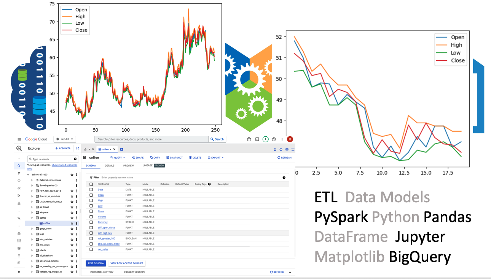
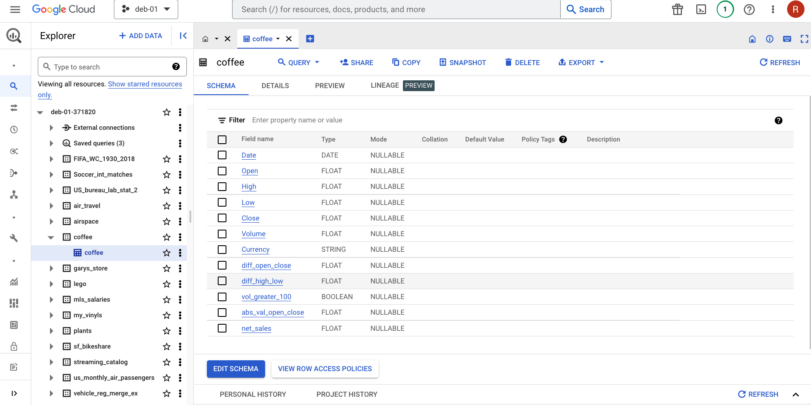

# Code Review: Spark ETL

#### By [Ruben Giosa](https://www.linkedin.com/in/rubengiosa/)

#### This repo showcases the creation of an ETL pipeline where data is extracted from a CSV file, transformed using Spark, then loaded into BigQuery.



<br>

## Technologies Used

* Python
* Spark
* BigQuery
* Jupyter
* `Matplotlib`
* Git
* Markdown
* `.gitignore`
* `requirements.txt`

</br>

## Description

This project creates a start-to-finish pipeline using Spark to organize Kaggle.com data about daily coffee prices on the stock market, and uses that data to answer questions about the prices of coffee shares on the stock market.

The CSV file with data is downloaded from:
```bash
gsutil -m cp gs://data.datastack.academy/coffee_price/coffee.csv .
```

This project follows the below steps:
1. Reads the data from `coffee.csv` into a Spark DataFrame.
2. Creates schema to ensure that all the columns are floats except for the 'Date' and 'Currency' columns.
3. Adds columns from Aggregate Functions where:
   1. Values are the difference between 'Open' and 'Close'.
   2. Values are the difference between 'High' and 'Low'.
   3. Values are 'True' if the volume for that day was 100 or above, and otherwise 'False'.
   4. Values are the absolute value of column for difference between 'Open' and 'Close'.
   5. net_sales is computed which is the is the average of opening, high, low, and closing cost times the volume
4. Finds specific stats regarding the data:
   1. Average of the values in the column that has the absolute values of the difference between 'Open' and 'Close'.
   2. Count of values where the 'Volume' was less than 100.
   3. Average 'Open' value.
   4. Max 'High' value.
5. Then the dataframe (including the four added columns) is saved to a parquet file.
6. `Matplotlib` is used to create two visualizations (i.e. a chart) using the coffee data.
7. Finally, the Parquet file is loaded to BigQuery. See snapshot below:




## Setup/Installation Requirements

* Go to https://github.com/rgiosa10/spark-cr.git to find the specific repository for this website.
* Then open your terminal. I recommend going to your Desktop directory:
    ```bash
    cd Desktop
    ```
* Then clone the repository by inputting: 
  ```bash
  git clone https://github.com/rgiosa10/spark-cr.git
  ```
* Go to the new directory or open the directory folder on your desktop:
  ```bash
  cd spark-cr
  ```
* open the directory in VS Code:
  ```bash
  code .
  ```
* Once VS Code is open, then create your virtual environment and pip install the requirements txt
  ```bash
    # create and run a python3.7 virtual env
    python3.7 -m venv venv
    source venv/bin/activate

    # pip install pypi packages
    pip install -r requirements.txt
    ```
* Update Google BiqQuery credentials to the correct project that you want to upload files to.
</br>

## Known Bugs

* No known bugs

<br>

## License

MIT License

Copyright (c) 2022 Ruben Giosa

Permission is hereby granted, free of charge, to any person obtaining a copy of this software and associated documentation files (the "Software"), to deal in the Software without restriction, including without limitation the rights to use, copy, modify, merge, publish, distribute, sublicense, and/or sell copies of the Software, and to permit persons to whom the Software is furnished to do so, subject to the following conditions:

The above copyright notice and this permission notice shall be included in all copies or substantial portions of the Software.

THE SOFTWARE IS PROVIDED "AS IS", WITHOUT WARRANTY OF ANY KIND, EXPRESS OR IMPLIED, INCLUDING BUT NOT LIMITED TO THE WARRANTIES OF MERCHANTABILITY, FITNESS FOR A PARTICULAR PURPOSE AND NONINFRINGEMENT. IN NO EVENT SHALL THE AUTHORS OR COPYRIGHT HOLDERS BE LIABLE FOR ANY CLAIM, DAMAGES OR OTHER LIABILITY, WHETHER IN AN ACTION OF CONTRACT, TORT OR OTHERWISE, ARISING FROM, OUT OF OR IN CONNECTION WITH THE SOFTWARE OR THE USE OR OTHER DEALINGS IN THE SOFTWARE.

</br>